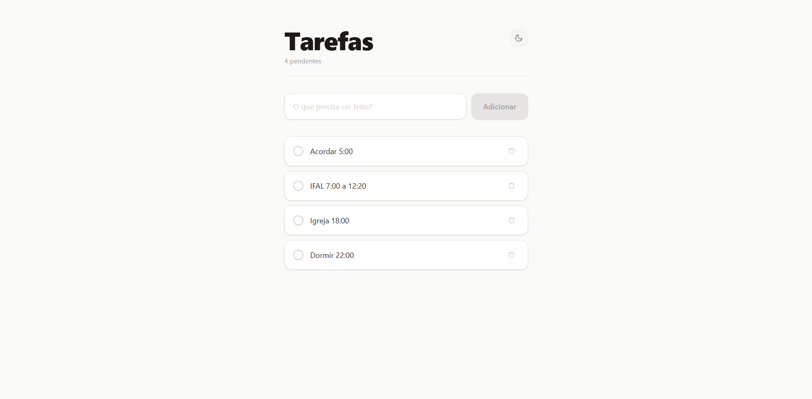
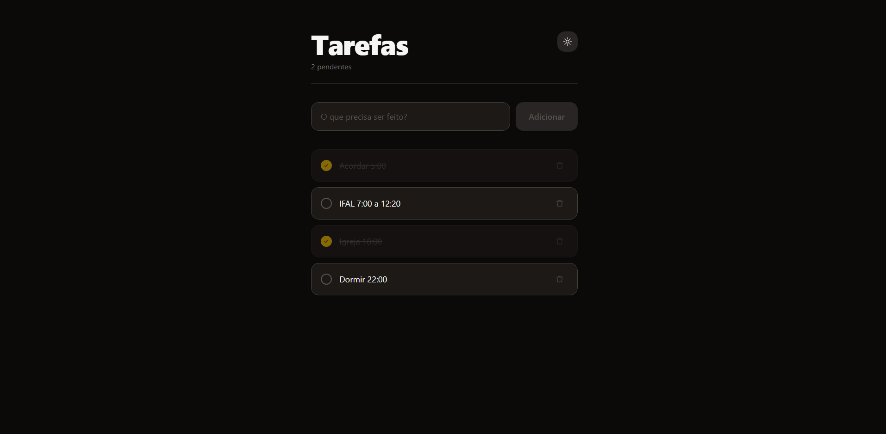

# 📝 TODO List — React

Aplicação de lista de tarefas desenvolvida com React, focada na prática de gerenciamento de estado, componentização e manipulação dinâmica de dados. A aplicação permite adicionar, concluir e remover tarefas com atualização instantânea da interface.

---

## 🚀 Demonstração

🔗 **Deploy:** https://seu-link-aqui.vercel.app  
📂 **Repositório:** https://github.com/seu-usuario/seu-repositorio

---
## 📸 Preview

---

## ✨ Funcionalidades

- Adicionar novas tarefas  
- Marcar tarefas como concluídas  
- Remover tarefas  
- Interface moderna e responsiva  
- Atualização dinâmica sem recarregar a página  

---

## 🛠️ Tecnologias Utilizadas

- React  
- JavaScript (ES6+)  
- Tailwind CSS  
- Vite  

---

## 🧠 Conceitos Aplicados

- useState para gerenciamento de estado  
- Renderização de listas com map  
- Atualização imutável de arrays  
- Componentização  
- Manipulação de eventos  

---
